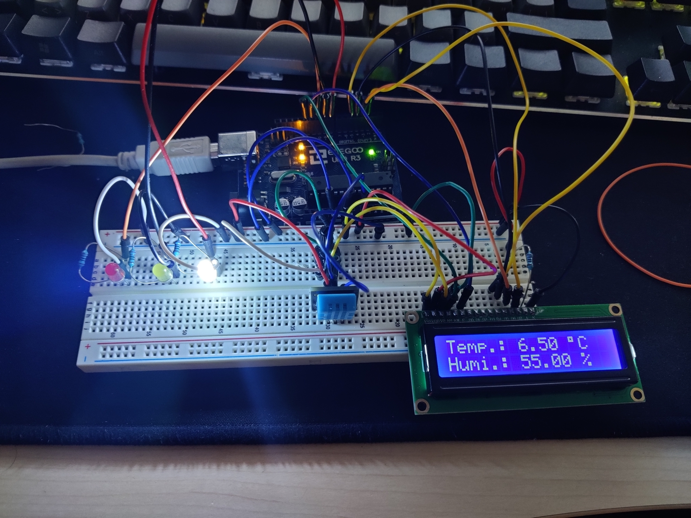
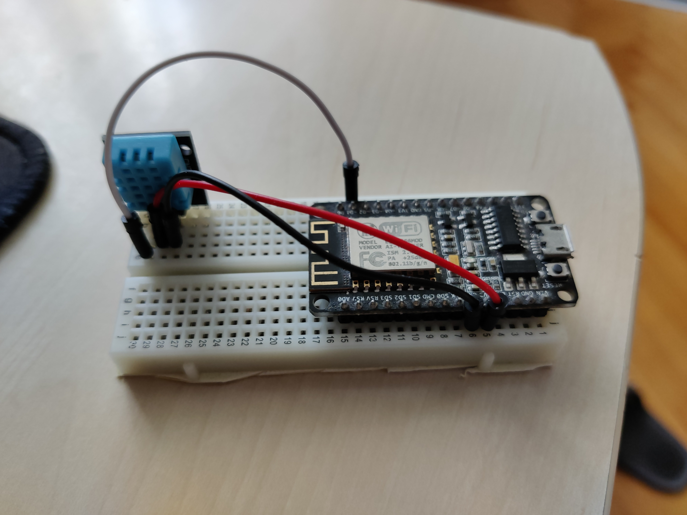
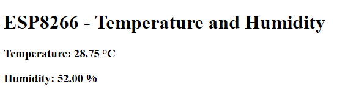

# VIN-Projekt-22-23

### Zunanja WiFi Vremenska postaja za merjenje temperature in vlažnosti
## **1. Klasična implementacija**
### **1.1 Komponente:** 
 - Arduino Eleggoo UNO R3
 - DHT11 modul
 - 19x moške žičke
 - 4x upor (220 ohm)
 - 1x potenciometer (10k ohm)
 - LED diode (3 barve)
 - LCD zaslon

### **1.2 Izgled prototipa**

### **1.3 Kako deluje**
Na arduino so priključeni LCD zaslon, dht11 senzor in 3 led diode, ki označujejo temperaturni rang. Pri komunikaciji z LCD zaslonom sem si pomagal z LiquidCrystal knjižnjico, pri DHT11 senzorju pa z dht knjižnjico. Z pomočjo LED diod lažje in hitreje razberemo temperaturo.
Lestvica je postavljena sledeče:
- rdeča: > 30°C
- rumena: < 30°C && > 10°C
- bela: < 10 °C

### **1.4 Možne izboljšave**
- Izdelati ohišje
- Zamenjati 3 LED diode z eno RGB LED diodo

## **2. IoT implementacija***
### **2.1 Komponente:** 
 - NodeMCU esp8266
 - DHT11 modul
 - 3x moške žičke

### **2.2 Izgled prototipa**

### **2.3 Izgled spletne strani**

### **2.4 Kako deluje**
Na esp8266 sem priključil zgolj DHT11 senzor. Na modulu že imamo WI-FI modul katerega sem uporabil za prikaz podatkov iz senzorja. Pomagal sem si z ESP8266WiFi in dht knjižnjico.

### **2.5 Možne izboljšave**
 - Izdelati ohišje
 - Pošiljati podatke na strežnik, da lahko uporabimo globoko spanje (trenutno je strežnik na esp8266) in olepšamo html stran / aplikacijo
 - Izboljšati energetsko učinkovitost z uporabo globokega spanja (https://randomnerdtutorials.com/esp8266-deep-sleep-with-arduino-ide/)
